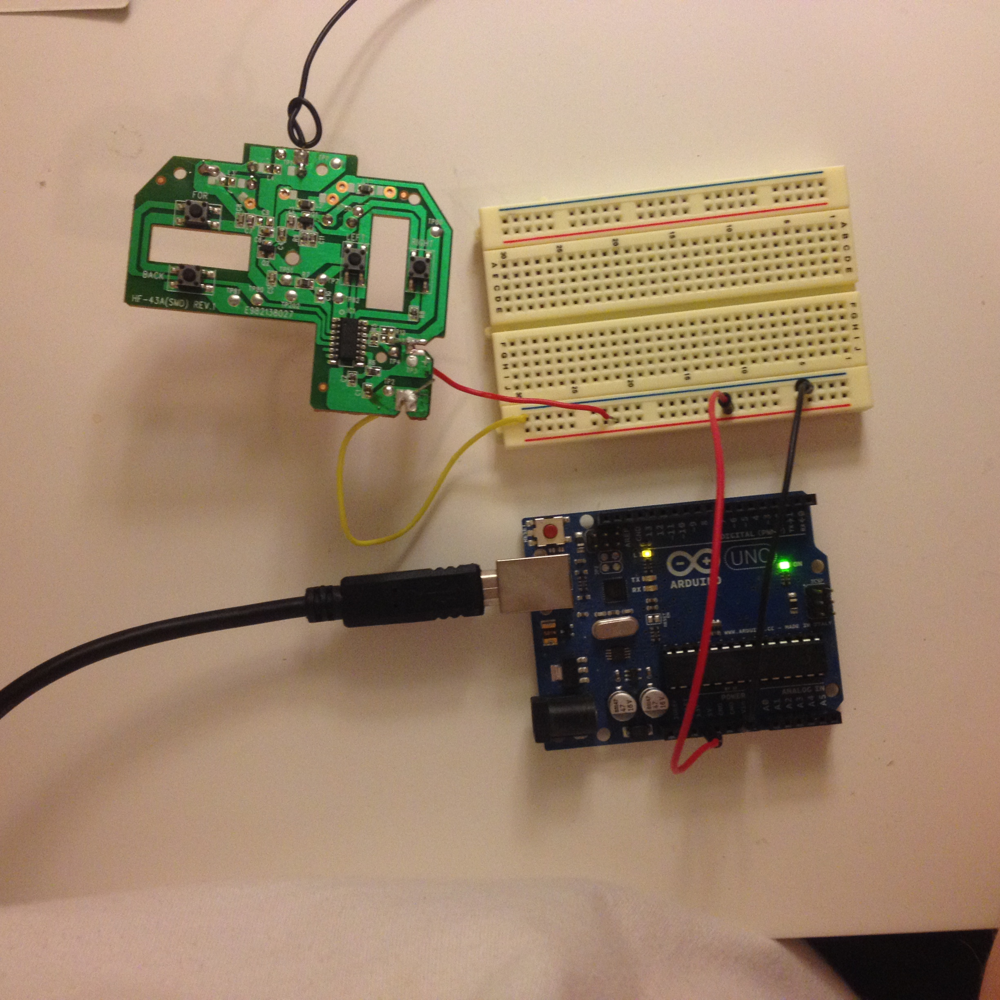

NodeJS Arduino RC Car
===============================

 

## The Idea

Drive a $9 RC Car with your Web Browser!

Web interface --> Node.js --> Serial port --> Arduino --> RC Controller --> RC Car

## Parts List

* [New Bright 1:24 Scale Radio Control Sports Car](https://www.walmart.com/ip/New-Bright-1-24-Scale-Radio-Control-Sports-Car/24389673)
* [Arduino Uno](https://www.amazon.com/Arduino-Uno-R3-Microcontroller-A000066/dp/B008GRTSV6)
* [USB to Serial Converter](https://www.amazon.com/TRENDnet-Converter-Prolific-Chipset-TU-S9/dp/B0007T27H8)
* Soldering iron, solder, breadboard, and wires

## Instructions

* Do the [Hardware Hack](https://github.com/richard512/NodeJS_Arduino_RC_Car/tree/master/hardware_hack)
* Hook up your USB to Serial Converter
* [Load](https://www.arduino.cc/en/Main/Howto) the [Basic Arduino Code](Arduino/back_forward.ino) and confirm that it works
* Load the [Advanced Arduino Code](Arduino/serial_port_controlled_car.ino) and confirm that it works
* Make sure you have NodeJS and npm, then go to the NodeJS dir in command line
* npm install coffee-script haml-coffee express.io express express-partials serialport
* Change ```portName``` in ```app.coffee``` to your serial device (Probably a USB to Serial Converter)
* Run ```coffee app.coffee```
* Go to [http://localhost:5000](http://localhost:5000)
* Drive!

## Arduino Commands

The Arduino will accept the following commands over a serial port connection:

* 0 - forward + left
* 1 - forward
* 2 - forward + right
* 3 - backward + left
* 4 - backward
* 5 - backward + right
* 6 - switches all off


The MIT License (MIT)
=========

Copyright © 2014 [Andrew Chalkley](http://twitter.com/chalkers) http://forefront.io

Permission is hereby granted, free of charge, to any person obtaining a copy of this software and associated documentation files (the “Software”), to deal in the Software without restriction, including without limitation the rights to use, copy, modify, merge, publish, distribute, sublicense, and/or sell copies of the Software, and to permit persons to whom the Software is furnished to do so, subject to the following conditions:

The above copyright notice and this permission notice shall be included in all copies or substantial portions of the Software.

THE SOFTWARE IS PROVIDED “AS IS”, WITHOUT WARRANTY OF ANY KIND, EXPRESS OR IMPLIED, INCLUDING BUT NOT LIMITED TO THE WARRANTIES OF MERCHANTABILITY, FITNESS FOR A PARTICULAR PURPOSE AND NONINFRINGEMENT. IN NO EVENT SHALL THE AUTHORS OR COPYRIGHT HOLDERS BE LIABLE FOR ANY CLAIM, DAMAGES OR OTHER LIABILITY, WHETHER IN AN ACTION OF CONTRACT, TORT OR OTHERWISE, ARISING FROM, OUT OF OR IN CONNECTION WITH THE SOFTWARE OR THE USE OR OTHER DEALINGS IN THE SOFTWARE.

