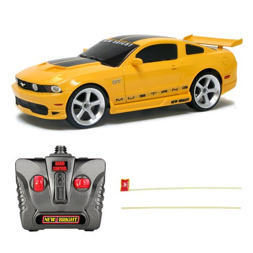
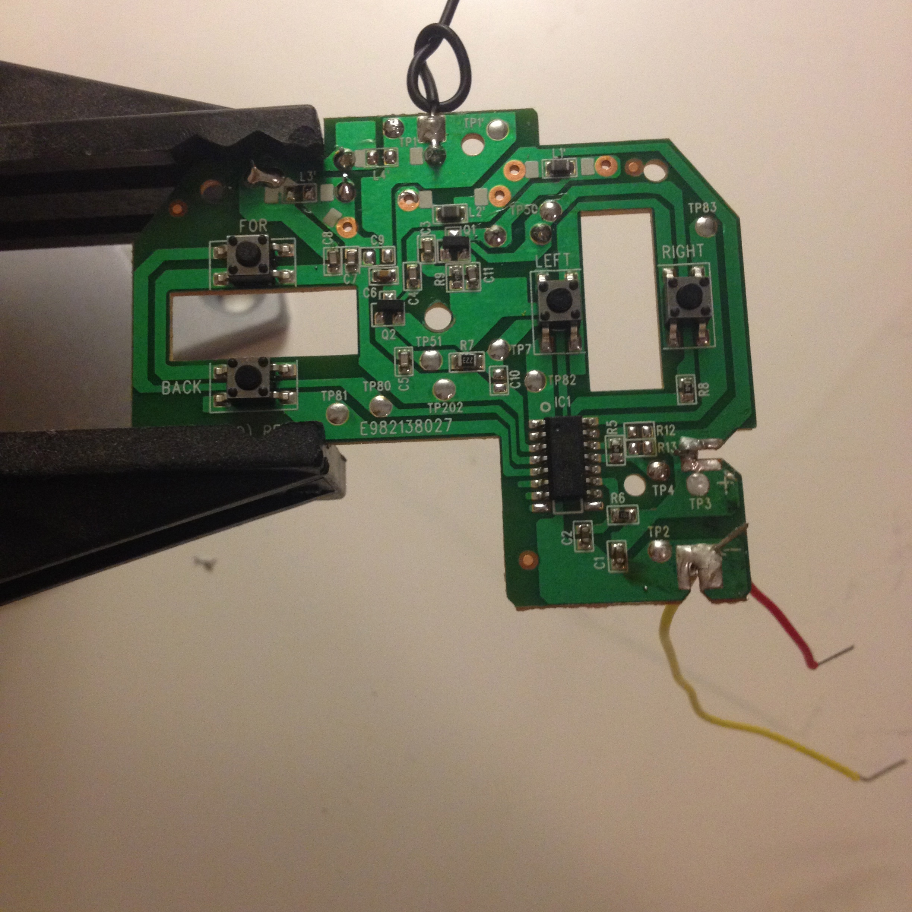
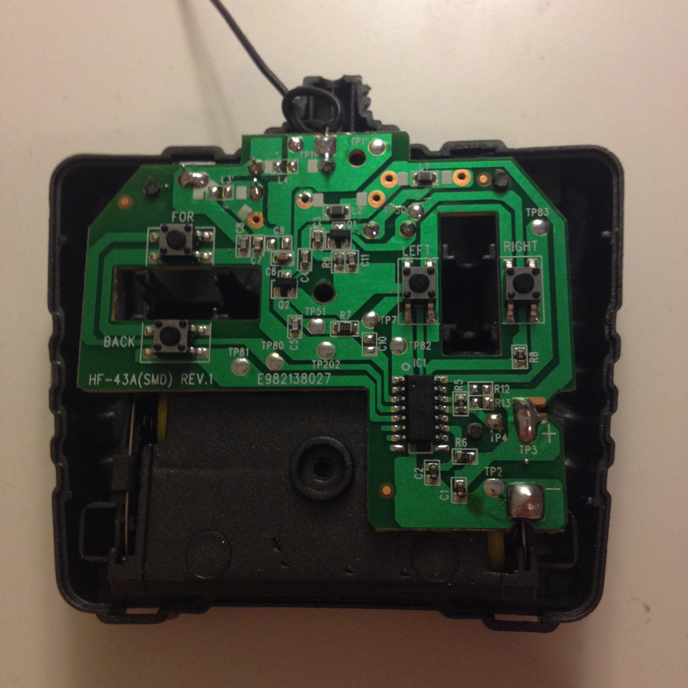
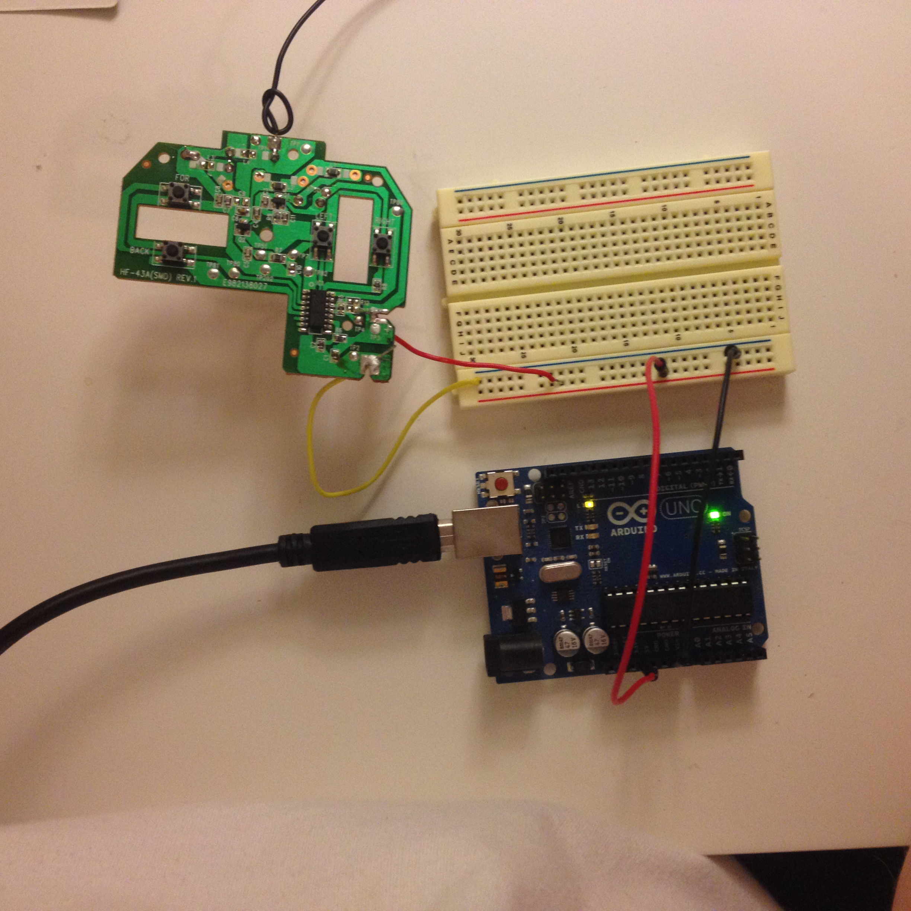

# The Hardware Hack

This project uses this $9 RC car available at Walmart:

[New Bright 1:24 Scale Radio Control Sports Car](https://www.walmart.com/ip/New-Bright-1-24-Scale-Radio-Control-Sports-Car/24389673)

## The Steps

* Open up the controller
* Desolder original connections to the battery compartment
* Red to the positive. Yellow to the negative.
* FOWARD = Attach Arduino pin 13 to the spot on the controller board marked TP80
* BACK = Attach Arduino pin 12 to the spot on the controller board marked TP81
* LEFT = Attach Arduino pin 8 to the spot on the controller board marked TP82
* RIGHT = Attach Arduino pin 7 to the spot on the controller board marked TP83
* Load back_forward.ino into the Arduino and see if it works
* If it does: Cooooool! Now try serial_port_controlled_car.ino

## Photos

